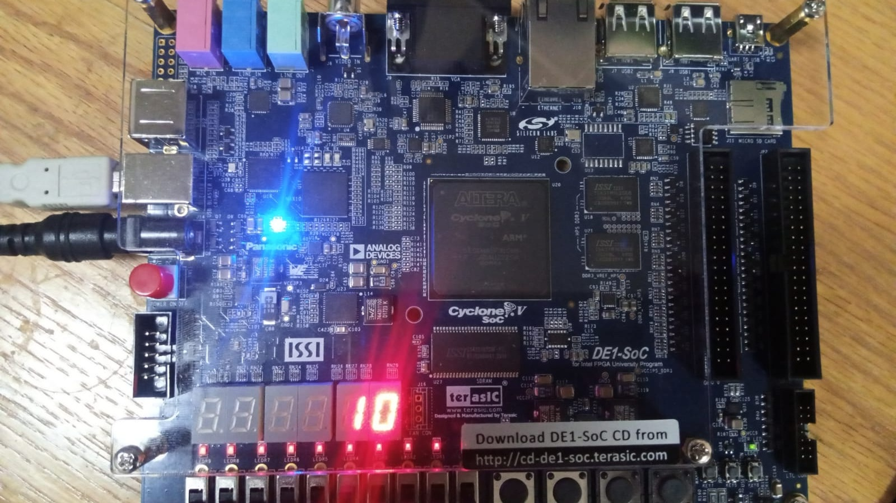
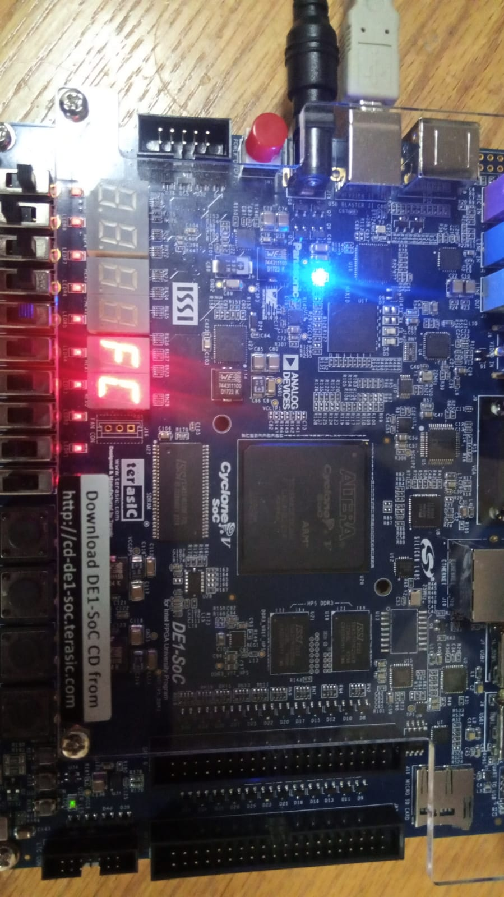

# DE1-SoC FPGA Hex Display

A professional 7-segment display system for the DE1-SoC development
board (Cyclone V 5CSEMA5F31C6), implemented in Verilog HDL using
Intel Quartus Prime 25.1.

This project builds upon my first FPGA project:
[alaminerca/7-segment-on-DE1-SOC-verilog-HDL](https://github.com/alaminerca/7-segment-on-DE1-SOC-verilog-HDL)
— which displayed a single digit (0-9) on one 7-segment display.
This version extends it with a reusable decoder module supporting
full hexadecimal (0-F) output across two displays simultaneously.

## Demo



## Features
- Full hexadecimal decoding (0-F) on two 7-segment displays
- Reusable `hex_decoder` module for use in future projects
- Controls HEX0 and HEX1 using SW[7:0] (8 switches)
- Clean modular design with separate top-level entity

## Hardware & Software
- **Board:** Terasic DE1-SoC
- **FPGA:** Intel Cyclone V 5CSEMA5F31C6
- **Tool:** Intel Quartus Prime Lite 25.1 (free)
- **Language:** Verilog HDL

## How to Reproduce

**1. Install tools**
Download and install [Intel Quartus Prime Lite](https://www.intel.com/content/www/us/en/products/details/fpga/development-tools/quartus-prime.html) (free).
During installation, select **Cyclone V** device support.

**2. Clone this repo**
```
git clone https://github.com/alaminerca/DE1-SoC-FPGA-Hex-Display.git
```

**3. Open the project**
Open Quartus Prime → File → Open Project → select `seven_seg.qpf`

**4. Compile**
Click Processing → Start Compilation. Wait for "Successful".

**5. Program the board**
- Connect DE1-SoC via USB Blaster II cable
- Click Tools → Programmer
- Select `output_files/seven_seg.sof`
- Click Start

**6. Test**
Flip SW[3:0] to control HEX0, SW[7:4] to control HEX1.
Values 0–F appear on the displays.

## Project Structure
```
src/
├── hex_decoder.v   # Reusable 7-segment decoder (0-F)
├── top_hex.v       # Top-level module
└── seven_seg.v     # Original single-digit decoder (0-9)
```

## Pin Assignments
| Signal  | FPGA Pin | Description     |
|---------|----------|-----------------|
| SW[0]   | PIN_AB12 | Slide Switch 0  |
| SW[7]   | PIN_AC9  | Slide Switch 7  |
| HEX0[0] | PIN_AE26 | Display 0 Seg a |
| HEX1[0] | PIN_AJ29 | Display 1 Seg a |

## Author
[alaminerca](https://github.com/alaminerca)